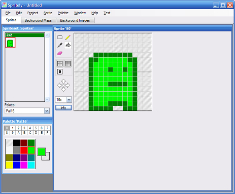

# Spritely

Spritely is an editor that allows you to easily create sprites for Gameboy
Advance (GBA) and Nintendo DS (NDS) programming projects. It is designed
specifically for programmers who are just starting out in GBA/NDS game
development.

Spritely is best described as a simple paint program that allows you to create
a set of foreground/background sprites and screen maps. It also includes an
"Export..." option that creates a complete GBA/NDS project - source code,
makefile and all.

In conjunction with [devkitPro](https://sourceforge.net/projects/devkitpro/) and
an emulator like [VisualBoyAdvance](https://sourceforge.net/projects/vba/), you
can easily create your own GBA/NDS games and get started in the wonderful world
of homebrew.

You can download the [latest version (v0.14.22) of Spritely](https://github.com/garykac/spritely/blob/gh-pages/downloads/Spritely_0.14.22.zip).

A [set of basic tutorials](http://garykac.github.io/spritely/tutorials/index.html) is also available.

For suggestions/bug-reports, go to the [Issues](https://github.com/garykac/spritely/issues) tab and
add a new entry (or comment on an existing one).
Send other comments to ɯoɔ˙ןıɐɯƃ@ɔɐʞʎɹɐƃ - please include "spritely" in the subject line.
